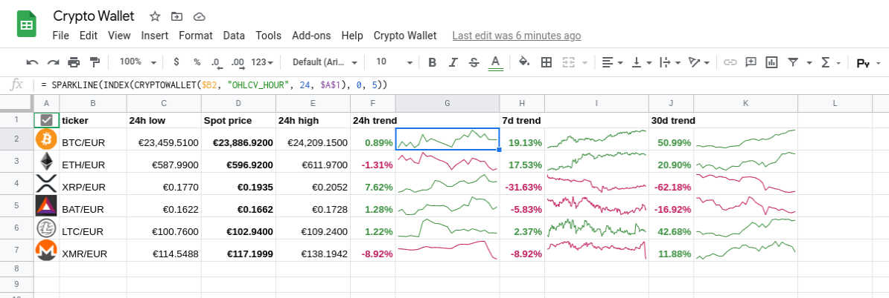
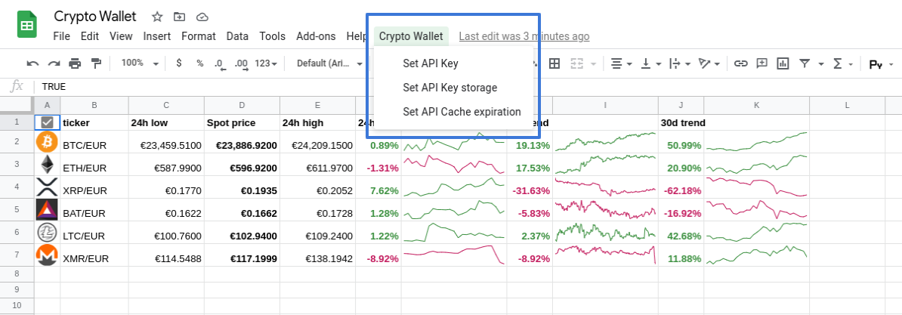

# Crypto Wallet

Custom function for Google Sheets that wraps [CryptoCompare API](https://www.cryptocompare.com/). This function can be
used to retrieve data based on your [subscription](https://min-api.cryptocompare.com/pricing).

All requests can be cached to minimize number of total API calls and API limits consumption. 



## Script installation

In your Google Sheet document open Script editor under **Tools > Script editor**. Copy-paste
[CryptoWallet](CryptoWallet.gs) code into opened Google Apps Script document and save it.

After script installation, you will need to reload your Google Sheets document.

## Configuration

After successful installation, there will be new menu entry _Crypto Wallet_. Use available menu items for configuration.



### Set API Key

_Set API Key_ item can be used to configure you individual CryptoCompare API key. Defaults to empty string.

By default the API key is saved in context of current user. If you need to share your document, incl. your data, set
_Set API Key storage_ to `document`.

Setting API Key to empty string, will reset the configuration to default empty string.

Calling CryptoCompare API without API can result into failing requests because of hitting API call limits.

### Set API Key storage

_Set API Key storage_ is used to configure context where the API key should be saved. Defaults to `user`.

Possible values are:
- `user`: API key is saved in context of current user, sharing the document will not share the API key, default;
- `document`: API key is saves in context of document, thus sharing the document will share also the API key, which will
  be visible to other users.

### Set API Cache expiration

_Set API Cache exporation_ is used for configuration of lifetime of cached entries. By default, the expiration limit 
is 300s.

Setting cache expiration to `0` will disable the cache at all.

## `CRYPTOWALLET` function

This function provides data from different CryptCompare APIs.

Currently, selection of exchange is not supported, all data are based on 
[Cryptocurrency Index](https://www.cryptocompare.com/coins/guides/how-does-our-cryptocurrecy-index-work/). 

**Syntax:** `= CRYPTOWALLET(ticker, attribute, limit, trigger)`

**Attributes:**
- `ticker`: `[EXCHANGE:]FROM[/TO]`, defines currency symbols for data retrieval and conversion, name of `EXCHANGE` is
  case-insensitive, `FROM` source symbol for data conversion, `TO` destination symbol for conversion (default "USD"),
  default `"BTC/USD""`;
- `attribute`: attribute for `FROM` symbol to return, see [Attributes](#attributes) for details; 
- `limit` number of returned OHLCV data points, default `1`;
- `toDate` return OHLCV data points before given date and time, note that TODAY() function returns time part of 00:00:00 
  respective to time zone of active Spreadsheet, the OHLCV history data use UTC time zone;
- `trigger`: this is helper attribute, which can be used for user initiated data update, see [Examples](#examples).

### Attributes

The attribute name is case-insensitive, internally it is being upper-cased. 

#### Detailed attributes

The CryptoCompare API returns many detailed attributes for each symbol. For detailed description see CryptoCompare
[API documentation](https://min-api.cryptocompare.com/documentation?key=Price&cat=multipleSymbolsFullPriceEndpoint).

Some attributes available without defined exchange:

```
FROMSYMBOL: "BTC"
TOSYMBOL: "USD"
CHANGE24HOUR: 164.25
CHANGEDAY: 93.31000000000131
CHANGEHOUR: -76.16999999999825
CHANGEPCT24HOUR: 0.5682999682720808
CHANGEPCTDAY: 0.32205924633787925
CHANGEPCTHOUR: -0.26137165732003037
CONVERSIONSYMBOL: ""
CONVERSIONTYPE: "direct"
HIGH24HOUR: 29672.93
HIGHDAY: 29666.33
HIGHHOUR: 29317.54
LASTMARKET: "itBit"
LASTTRADEID: "5WQDTDSZ7TG3"
LASTUPDATE: 1609525820
LASTVOLUME: 0.01710783
LASTVOLUMETO: 497.49997335750004
LOW24HOUR: 28744.69
LOWDAY: 28748.21
LOWHOUR: 29043.35
MEDIAN: 29076.91
MKTCAP: 540100675000.32
MKTCAPPENALTY: 0
OPEN24HOUR: 28901.99
OPENDAY: 28972.93
OPENHOUR: 29142.41
PRICE: 29066.24
SUPPLY: 18581718
TOPTIERVOLUME24HOUR: 52632.09519490999
TOPTIERVOLUME24HOURTO: 1537725614.1994383
TOTALTOPTIERVOLUME24H: 285632.02441492473
TOTALTOPTIERVOLUME24HTO: 8310157476.8914
TOTALVOLUME24H: 304111.4677764088
TOTALVOLUME24HTO: 8847285321.026815
VOLUME24HOUR: 52632.38891408499
VOLUME24HOURTO: 1537734059.8355834
VOLUMEDAY: 40365.18342619532
VOLUMEDAYTO: 1181795475.6391394
VOLUMEHOUR: 1588.0403260099663
VOLUMEHOURTO: 46360554.31703421
```

Attributes available for exchange related data:

```
MARKET: "CUSTOMAGG"
FROMSYMBOL: "BTC"
TOSYMBOL: "EUR"
CHANGE24HOUR: 319.90000000000146
CHANGEDAY: 0
CHANGEHOUR: 0
CHANGEPCT24HOUR: 1.3527971480887944
CHANGEPCTDAY: 0
CHANGEPCTHOUR: 0
FLAGS: 0
HIGH24HOUR: 24180.1
LASTMARKET: "Kraken"
LASTTRADEID: "1609542372.6873"
LASTUPDATE: 1609542372
LASTVOLUME: 0.01120721
LASTVOLUMETO: 268.605443512
LOW24HOUR: 23458.9
OPEN24HOUR: 23647.3
PRICE: 23967.2
TOPTIERVOLUME24HOUR: 3904.08263326
TOPTIERVOLUME24HOURTO: 93229444.8026467
VOLUME24HOUR: 3904.08263326
VOLUME24HOURTO: 93229444.8026467
```

#### History data

History data are available based on your CryptoCompare [subscription](https://min-api.cryptocompare.com/pricing).

Basic history data can be retrieved using base OHLCV attributes, all of them returns array with columns "Date", "Open", 
"High", "Low", "Close", "Volume ${FROM}", "Volume ${TO}". 

- `OHLCV_MINUTE`: history data per minute, free subscription offers one day of history;
- `OHLCV_HOUR`: history data per hour, free subscription offers 3 months of history;
- `OHLCV_DAY`: history data per day, free subscription offers full history;

The absolute change in history data set:

- `OHLCV_CHANGE_MINUTE`: the absolute difference between last and first datapoint in minute-based history; 
- `OHLCV_CHANGE_HOUR`: the absolute difference between last and first datapoint in hour-based history;
- `OHLCV_CHANGE_DAY`: the absolute difference between last and first datapoint in day-based history;

The percentage change in history data set:

- `OHLCV_CHANGEPCT_MINUTE`: the percentage difference between last and first datapoint in minute-based history; 
- `OHLCV_CHANGEPCT_HOUR`: the percentage difference between last and first datapoint in hour-based history;
- `OHLCV_CHANGEPCT_DAY`: the percentage difference between last and first datapoint in day-based history;

#### Special attributes

- `IMAGE`: full URL to symbol icon from CryptoCurrency

### Examples

- current price of BTC in EUR: `= CRYPTOWALLET("BTC/EUR", "PRICE")`;
- current price of BTC in EUR on Coinbase: `= CRYPTOWALLET("COINBASE:BTC/EUR", "PRICE")`;
- low price in last 24 hours: `= CRYPTOWALLET("BTC", "LOW24HOUR")`;
- display icon of crypto: `= IMAGE(CRYPTOWALLET("ETH", "IMAGE"))`;
- complete OHLCV data for last 30 days: `= SPARKLINE(INDEX(CRYPTOWALLET($B2, "OHLCV_DAY", 30), 0, 5))`;
- complete OHLCV data for specific day: `= SPARKLINE(INDEX(CRYPTOWALLET($B2, "OHLCV_DAY", 1, "2020-12-31"), 0, 5))`;
- display sparkline in the current cell from close price of last 30 days: 
  `= SPARKLINE(INDEX(CRYPTOWALLET("BTC/EUR", "OHLCV_DAY", 30), 0, 5))`;
- simple user initiated data update can be defined using helper attribute `trigger`, first, insert Checkbox into some 
  cell, e.g. `A1`, then define function call using reference to that cell, in our case 
  `= CRYPTOWALLET("BTC/EUR", "PRICE". "", """, $A$1)`, each time the checkbox is clicked, all referencing function 
  definitions are updated;
